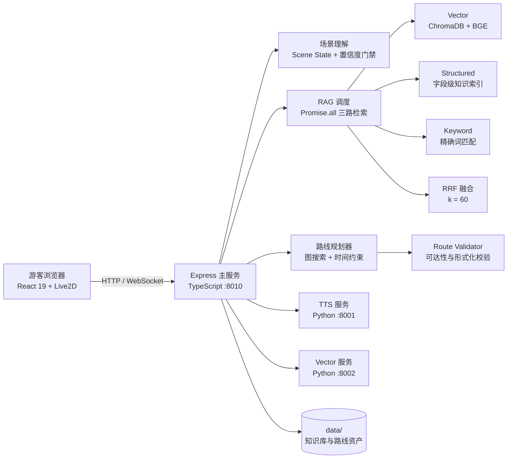

<div align="center">

# 灵小禅 · 灵山胜境可信文旅决策智能体

**把景区问答升级为可验证的游客决策：理解自然语言，检索事实，规划可执行路线，并诚实说明不可行条件。**

[](https://github.com/Mao123-doc/lingshan-ai-guide/actions/workflows/ci.yml)
[](https://github.com/Mao123-doc/lingshan-ai-guide)
[](LICENSE)
[](https://nodejs.org)
[](https://www.python.org)
[](https://react.dev)

</div>

## 项目定位

灵小禅面向灵山胜境真实游客场景，提供数字人问答、景点讲解、语音播报、图片识别和多约束路线规划。它不把路线可行性完全交给大语言模型，而是将“语义理解”和“物理决策”分开：模型负责理解游客表达与组织解释，确定性规划器负责时间预算、路网连通、行动能力、演出时间窗和最终可行性校验。

游客可以提出类似这样的请求：

> 我带腿脚不方便的妈妈，现在在景区入口，还有三小时，想看一场演出，应该怎么安排？

系统会提取当前位置、开始时间、剩余时长、同行人、行动能力、兴趣和演艺偏好等状态；缺少关键条件时先追问，硬约束无法满足时明确拒绝并给出替代方案，不为了“给出一条路线”而生成不可执行的行程。

## 核心能力

- 🧭 **可信游客决策**：从自然语言需求提取结构化场景状态，生成带步骤、时间预算、证据和可行性结果的路线。
- 🔎 **三路混合检索**：向量、结构化字段和关键词检索通过 `Promise.all` 并行执行，使用 RRF（`k=60`）融合候选，再进行可选重排。
- 🧱 **确定性路线规划**：基于当前路线资产中的 23 个节点、30 条登记道路边、景点停留时间、坡度/可达性和演出时间窗进行规划与验证。
- ♿ **无障碍约束**：对轮椅和行动不便游客过滤不可达道路或景点，并在结果中保留被拒绝请求及原因。
- ⏱️ **诚实拒绝与优雅降级**：区分 `feasible`、`feasible_with_rejected_preferences`、`needs_clarification` 和 `infeasible`，缺信息就追问，超时就解释。
- 🧾 **可审计证据链**：记录 query rewrite、三路检索、RRF、重排、上下文、生成和 fallback 状态，支持回溯“答案为什么产生”。
- 🧑‍🎨 **数字人交互**：React + Live2D/PixiJS 游客端，支持问答、路线看板、语音交互、景点图片和情绪反馈。
- 🛠️ **运营管理后台**：JWT 认证、知识库上传和索引重建、对话导出、情感分析、游客统计和数字人配置。

## 系统架构



### 双引擎职责

| 问题 | 负责模块 | 结果 |
| --- | --- | --- |
| 游客怎么表达需求 | LLM + 规则抽取 | 结构化 Scene State、置信度、缺失字段 |
| 景点事实是什么 | Hybrid RAG | 证据文档、来源、检索 Trace |
| 路线是否走得通 | Planner + Validator | 路线步骤、耗时、满足项、违规项 |
| 条件不完整怎么办 | 澄清门禁 | 面向游客的追问，而不是猜测 |
| 条件无法同时满足怎么办 | 可行性状态机 | 诚实拒绝、部分满足或备选路线 |

## 快速开始

### 环境要求

- Node.js `>=18`
- Python `>=3.10`
- Windows 下推荐使用 PowerShell、Chrome 或 Edge
- 如需完整 RAG 与语音能力，需要配置 LLM API，并安装 Python 服务依赖

### 安装与配置

```powershell
git clone https://github.com/Mao123-doc/lingshan-ai-guide.git
cd lingshan-ai-guide

npm run setup
Copy-Item .env.example .env
```

编辑 `.env`，至少配置一个可用的文本模型 API：

| 变量 | 用途 | 默认值 |
| --- | --- | --- |
| `DEEPSEEK_API_KEY` | 文本生成与相关模型调用 | 无 |
| `DEEPSEEK_MODEL` | DeepSeek 模型名 | `deepseek-chat` |
| `AGNES_API_KEY` | 多模态与文本 fallback | 无 |
| `AGNES_MODEL` | 多模态模型名 | `agnes-2.0-flash` |
| `AGNES_BASE_URL` | Agnes OpenAI-compatible 地址 | `https://apihub.agnes-ai.com/v1` |
| `PORT` | Express 主服务端口 | `8010` |
| `CORS_ORIGINS` | 跨域白名单 | `http://localhost:5173,http://localhost:8010` |
| `SECRET_KEY` | JWT 签名密钥 | 请在生产环境替换 |

### 启动完整本地服务

最简单的 Windows 方式是双击 `scripts/start.bat`。它会安装依赖、构建前端，并依次启动：

- TTS 服务：`http://127.0.0.1:8001`
- 向量检索服务：`http://127.0.0.1:8002`
- Express 主服务：`http://localhost:8010`

也可以手动启动：

```powershell
# 构建前端并编译后端
npm run build

# 终端 1：TTS
python backend/python/tts_server.py

# 终端 2：向量检索
python backend/python/vector_service.py

# 终端 3：主服务
npm run dev
```

启动后访问：

- 游客首页：<http://localhost:8010/>
- 问答页：<http://localhost:8010/qa>
- 路线规划页：<http://localhost:8010/recommend>
- 管理后台：<http://localhost:8010/admin/login>
- 健康检查：<http://localhost:8010/health>

本地演示默认管理员账号为 `admin / lingshan2026`。生产部署前请替换密钥并修改默认凭据，不要直接暴露演示配置。

### 前端热更新

生产构建由 Express 托管 `frontend/dist`。开发前端页面时，可另开终端启动 Vite：

```powershell
npm --prefix frontend run dev
```

开发地址为 <http://localhost:5173>，其 API 请求需要指向正在运行的 `8010` 主服务。

## API 入口

所有接口前缀为 `/api/v1`。

| 方法 | 路径 | 说明 |
| --- | --- | --- |
| `POST` | `/visitor/qa` | 基于知识证据的游客问答，支持流式结果 |
| `POST` | `/visitor/route/plan` | 统一路线规划入口，接受自然语言或结构化 `scene_state` |
| `POST` | `/visitor/recommend` | 兼容旧客户端的路线推荐适配入口 |
| `POST` | `/visitor/tts` | 文本转语音 |
| `POST` | `/visitor/vision/recognize` | 景点图片识别与讲解 |
| `GET` | `/visitor/spots` | 景点列表与详情 |
| `GET` | `/visitor/nearby` | 按坐标查询周边景点 |
| `GET` | `/visitor/nearby-facilities` | 查询周边设施 |
| `POST` | `/auth/login` | 管理员登录并获取 JWT |
| `POST` | `/auth/refresh` | 刷新管理员 JWT |
| `*` | `/admin/*` | JWT 保护的运营管理接口 |

路线规划请求可以只传自然语言：

```json
{
  "query": "我带轮椅游客，现在在南门，还有90分钟，想去灵山梵宫"
}
```

也可以传入已经结构化的场景状态：

```json
{
  "scene_state": {
    "currentLocation": "south_gate",
    "currentTime": "10:00",
    "remainingMinutes": 90,
    "mobility": "wheelchair",
    "mustVisitSpotIds": ["LS-013"]
  }
}
```

返回结果包含 `feasibility`、`outcome`、`route`、`explanation`、`evidence` 和 `scene_extraction`，便于前端展示，也便于测试和审计。

## 评测与证据

项目把“能演示”与“可复核”分开记录。权威结果和复现实验说明见：

- [评测证据报告](docs/competition/evaluation-report.md)
- [RAG 消融报告](docs/ablation_report.md)
- [项目限制与下一阶段](docs/competition/limitations.md)
- [最终交付包](release/competition_final/README.md)

当前冻结证据包括：

| 评测项 | 结果 | 说明 |
| --- | ---: | --- |
| 50 题 Fact Contract 基线 | `48/50`，`96.0%` | 2026-09-17 历史质量门禁通过运行 |
| 7 组检索消融 | Full retrieval `98.0%` | 单次受控运行观察值，不作普遍因果结论 |
| Scene State Gold cases | `40/40` | 场景槽位与关键缺失识别 |
| Route Benchmark | `60/60` | 形式化验证通过，hard violations 为 `0` |

2026-09-21 的独立消融重跑因 LLM provider 失败而未通过质量门禁，其诊断数值不会替换上面的历史权威结果。所有正式数字应以实验目录中的 manifest、原始结果、代码 SHA 和质量门禁为准。

运行本地单元与构建检查：

```powershell
# Python 工具测试
python -m unittest discover -s backend/python/tools -p "test_*.py"

# 后端 TypeScript 测试与构建
npm test --prefix backend
npm run build --prefix backend

# 前端单测与构建
npm run test:unit --prefix frontend
npm run build --prefix frontend
```

完整 CI 还包含前端 lint、浏览器桌面/移动端旅程和 Python quality gates，配置见 [.github/workflows/ci.yml](.github/workflows/ci.yml)。

## 项目结构

```text
lingshan-ai-guide/
├── backend/
│   ├── src/api/v1/                 # 游客、认证与管理 API
│   ├── src/services/               # RAG、场景理解、路线规划、校验、TTS、情绪
│   └── python/                     # 向量检索、TTS、ASR 与评测工具
├── frontend/
│   ├── src/pages/visitor/           # 首页、问答页、路线推荐页
│   ├── src/pages/admin/             # 管理后台页面
│   └── public/                     # Live2D 模型与景点静态资源
├── data/
│   ├── raw/                        # 官方指南与知识库原始语料
│   └── route/                      # 23 个节点、30 条道路边、设施与演出数据
├── docs/                           # 架构、评测、竞赛与限制说明
├── evaluation/                     # 版本化评测结果与证据清单
├── release/competition_final/      # 当前竞赛交付包
├── scripts/                        # 启停、评测、审计和交付脚本
└── .github/workflows/ci.yml        # CI：构建、测试、质量门禁与浏览器旅程
```

## 设计边界

- 大语言模型负责语义理解和自然语言解释，不能直接生成或宣称路线 `steps` 与 `feasible`。
- 路线结果依赖当前 `data/route/` 资产；当前记录为 23 个节点和 30 条道路边，不把“31 条道路”作为已核验事实。
- 评测中的 96.0% 和 98.0% 是有明确数据集、配置和运行上下文的实验结果，不是所有真实游客问题的准确率承诺。
- 当前系统是可验证的导览决策原型，不能替代景区实时地图、现场安全指引或运营方对道路和演艺状态的核验。

## 贡献

欢迎提交 Issue 和 Pull Request。涉及 RAG、场景抽取或路线规划的改动，请同时更新对应测试和评测说明；涉及竞赛材料的改动，请遵守项目 [AGENTS.md](AGENTS.md) 中的事实、架构和路线真实性约束。

```powershell
git checkout -b codex/your-change
npm run lint
npm run build
```

## 许可证

本项目基于 [MIT License](LICENSE) 开源。

## 项目链接

- GitHub：[Mao123-doc/lingshan-ai-guide](https://github.com/Mao123-doc/lingshan-ai-guide)
- 当前交付目录：[release/competition_final](release/competition_final/)
- 竞赛材料入口：[竞赛汇报与文档材料包](竞赛汇报与文档材料包/)
