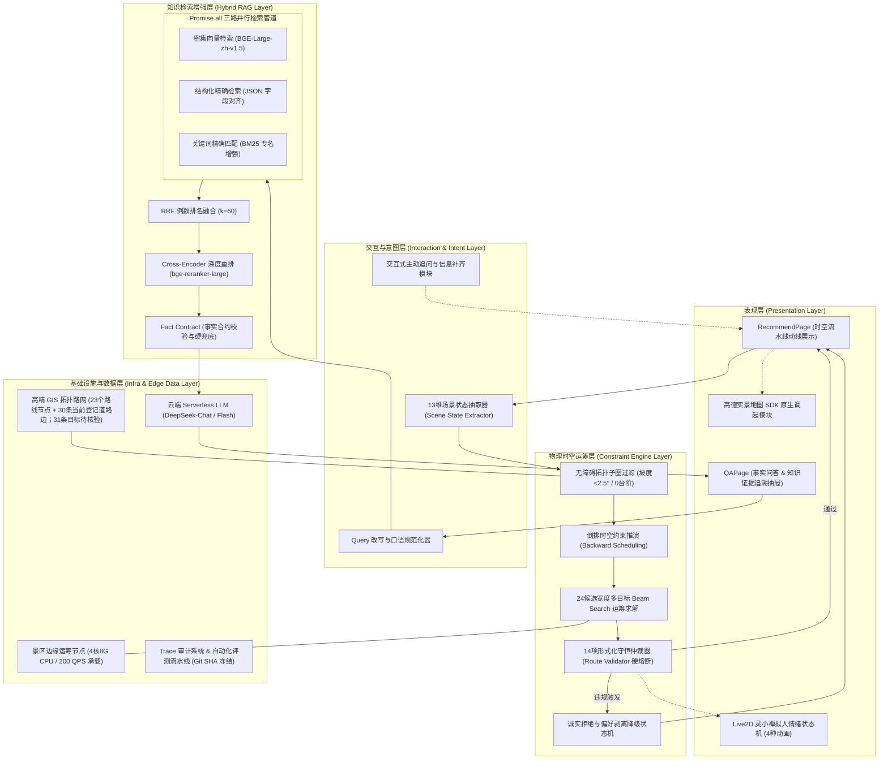
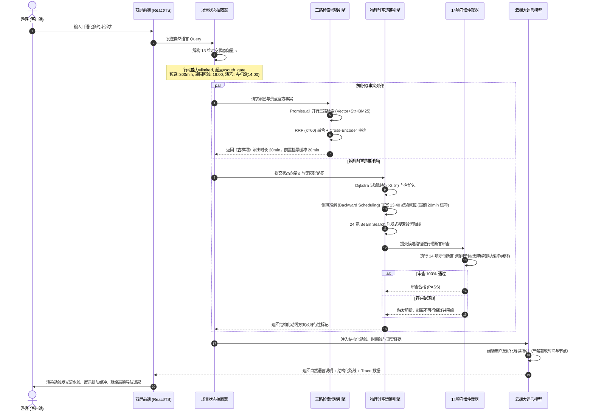
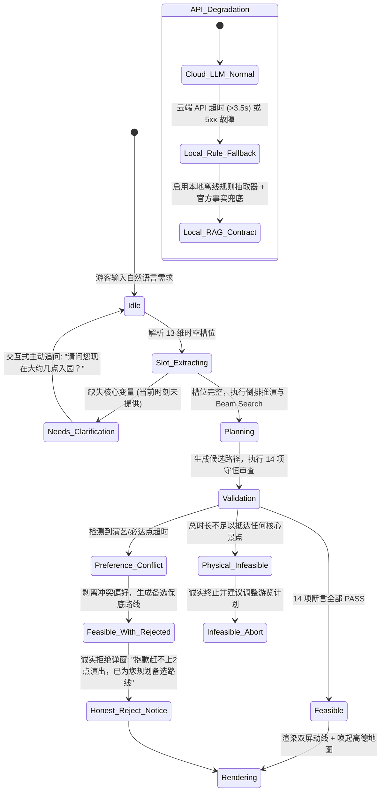

# “灵小禅”可信文旅决策智能体：系统总体技术架构说明书
## ——面向复杂时空约束的五层解耦工业级系统架构与交付规范

---

## 1. 架构定位与核心设计原则

“灵小禅”系统定位于面向真实复杂文旅场景的**高确定性、可信时空决策智能体**。系统转变了“通用大模型端到端直出”的脆弱技术路径，践行**“双引擎协同解耦”**的核心设计哲学：
- **概率生成与确定运筹解耦**：非结构化自然语言的理解与用户化表达由大语言模型（LLM）驱动；而涉及物理安全、时间守恒、路网连通与演艺时效的硬约束决策，100% 由确定性运筹引擎与形式化仲裁器接管；
- **全链路证据闭环与防篡改**：检索、重排、槽位抽取与路线生成的每一步均输出不可变 Trace 日志，严密绑定 Git Commit SHA 与数据哈希，实现可审计、可追溯、可复现；
- **轻量化边云协同**：算力密集但图规模受控（23 个路线节点+30 条当前登记道路边；31 条为待补齐核验的目标口径）的运筹计算完全下沉至边缘轻量节点，单台 4 核 8G CPU 服务器即可稳定承载 200 QPS 并发，大幅降低景区数字化转型门槛。

---

## 2. 五层解耦工业级总体技术架构

系统在工程上划分为五个高度内聚、低耦合的技术层次：
1. **表现层 (Presentation Layer)**：承载游客端交互，包含 React/TypeScript 打造的 `QAPage`（问答与证据追溯屏）、`RecommendPage`（动线与高德实景导航屏）以及 `Live2D` 拟人情绪状态机；
2. **交互与意图层 (Interaction & Intent Layer)**：负责自然语言 Query 改写、13 维时空场景状态槽位抽取（Scene State Extractor）以及关键决策信息的主动追问；
3. **知识检索增强层 (Hybrid RAG Layer)**：通过 `Promise.all` 驱动向量检索（BGE-Large-zh-v1.5）、结构化检索与 BM25 关键词精确检索并行执行，经 RRF ($k=60$) 与 Cross-Encoder 重排后注入上下文，并受 Fact Contract（事实合约）硬兜底；
4. **物理时空运筹层 (Constraint Engine Layer)**：基于无障碍拓扑子图，运行倒排时空推演（Backward Scheduling）与 24 宽多目标 Beam Search 算法，并通过独立的 14 项形式化守恒仲裁器（Route Validator）执行硬熔断；
5. **基础设施与数据层 (Infra & Edge Data Layer)**：涵盖 4 核 8G 景区边缘运筹节点、云端弹性 Serverless 大模型接口、高精 GIS 拓扑路网数据库以及全链路自动化评测流水线。

### 2.1 系统分层架构图 (Mermaid)



---

## 3. 端到端系统交互时序图

下图展示游客发起复杂口语诉求（“*我带腿脚不方便的妈妈，现在在正门，预计下午四点前返程（限时5小时），想看两点的《吉祥颂》，怎么走？*”）的端到端执行流：



---

## 4. 标准 RESTful / JSON API 交互契约

系统前后端及微服务之间通过严格的强类型 JSON API 交互，确保数据契约严密。

### 4.1 知识增强问答接口：`/api/chat/rag`

- **请求方式**：`POST`
- **Content-Type**：`application/json`

#### Request Payload Schema
```json
{
  "query": "灵山大佛门票多少钱？包含吉祥颂演出吗？",
  "session_id": "sess_20260920_user8839",
  "user_context": {
    "location_node": "south_gate",
    "timestamp": "2026-09-20T11:00:00+08:00"
  },
  "retrieval_config": {
    "enable_rewrite": true,
    "enable_vector": true,
    "enable_structured": true,
    "enable_keyword": true,
    "enable_rerank": true,
    "top_k_retrieval": 8,
    "top_k_context": 5
  }
}
```

#### Response Payload Schema
```json
{
  "code": 200,
  "status": "success",
  "data": {
    "answer": "灵山胜境景区普通全票为 210 元/人。门票包含灵山大佛、九龙灌浴等室外景观，但《梵宫·吉祥颂》属于专项演艺，通常需单独购买演出票或购买包含该演出的套票（套票一般为 230 元/人）。建议您入园后在游客中心或官方小程序确认当日场次票务余量。",
    "fact_contract_passed": true,
    "trace": {
      "trace_id": "tr_rag_99812401",
      "latency_ms": 2882.68,
      "query_rewrite": {
        "original": "灵山大佛门票多少钱？包含吉祥颂演出吗？",
        "rewritten": "灵山大佛门票价格 梵宫吉祥颂演出是否包含在门票内"
      },
      "retrieval_channels": {
        "vector": { "executed": true, "result_count": 8 },
        "structured": { "executed": true, "result_count": 3 },
        "keyword": { "executed": true, "result_count": 8 }
      },
      "rrf_fusion": { "fused_candidates_count": 14 },
      "rerank": {
        "model": "BAAI/bge-reranker-large",
        "selected_context_ids": ["doc_ticket_pricing_2026", "doc_jixiangsong_spec_v2"]
      },
      "generation": {
        "requested_model": "deepseek-chat",
        "provider_model": "deepseek-flash",
        "fallback_used": false
      }
    }
  }
}
```

---

### 4.2 物理时空约束规划接口：`/api/route/plan`

- **请求方式**：`POST`
- **Content-Type**：`application/json`

#### Request Payload Schema
```json
{
  "query": "我带坐轮椅的母亲，现在在正门，预计下午4点前返程（限时5小时），想看14:00的吉祥颂",
  "scene_state": {
    "current_time": 660,
    "time_budget": 300,
    "deadline": 960,
    "start_node": "south_gate",
    "mobility": "wheelchair",
    "crowd_type": ["elderly"],
    "must_visit_nodes": ["grand_buddha"],
    "entertainment_preferences": [
      {
        "event_id": "jixiangsong",
        "target_start_time": 840,
        "duration": 20,
        "location_node": "brahma_palace"
      }
    ]
  },
  "constraints": {
    "max_slope_degree": 2.5,
    "require_step_free": true,
    "min_queue_buffer_minutes": 20
  }
}
```

#### Response Payload Schema
```json
{
  "code": 200,
  "status": "success",
  "data": {
    "feasibility_status": "feasible",
    "total_duration_minutes": 300,
    "total_walking_distance_meters": 2850,
    "itinerary": [
      {
        "step_index": 1,
        "node_id": "south_gate",
        "node_name": "景区正门",
        "arrival_time": "11:00",
        "departure_time": "11:08",
        "action": "start",
        "stay_duration_minutes": 8,
        "path_attributes": { "slope_degree": 1.2, "steps_count": 0, "mode": "walk" }
      },
      {
        "step_index": 2,
        "node_id": "nine_dragons",
        "node_name": "九龙灌浴",
        "arrival_time": "11:50",
        "departure_time": "12:20",
        "action": "entertainment",
        "stay_duration_minutes": 30,
        "walking_from_prev_minutes": 15,
        "queue_buffer_minutes": 10,
        "performance_window": { "start": "12:00", "end": "12:20" }
      },
      {
        "step_index": 3,
        "node_id": "brahma_palace",
        "node_name": "梵宫·吉祥颂",
        "arrival_time": "13:40",
        "departure_time": "14:20",
        "action": "entertainment",
        "stay_duration_minutes": 40,
        "walking_from_prev_minutes": 20,
        "queue_buffer_minutes": 20,
        "dynamic_adjustment_applied": "12:30 突发超时 10min，秒级微调林道漫步时长确保 13:40 准时检票",
        "performance_window": { "start": "14:00", "end": "14:20" }
      },
      {
        "step_index": 4,
        "node_id": "grand_buddha_plaza",
        "node_name": "灵山大佛广场(无障碍电梯登顶)",
        "arrival_time": "15:10",
        "departure_time": "15:40",
        "action": "visit",
        "stay_duration_minutes": 30,
        "path_attributes": { "mode": "shuttle_bus" }
      },
      {
        "step_index": 5,
        "node_id": "south_gate",
        "node_name": "景区正门(离园)",
        "arrival_time": "16:00",
        "departure_time": "16:00",
        "action": "exit",
        "walking_from_prev_minutes": 20
      }
    ],
    "validation_summary": {
      "validator_version": "v2.6_formal",
      "total_checks": 14,
      "passed_checks": 14,
      "hard_violations_count": 0,
      "wheelchair_compliant": true,
      "max_slope_observed": 1.8
    }
  }
}
```

---

## 5. 容灾状态机与优雅降级机制

在实际文旅网络与硬件环境下，可能面临网络超时、大模型 API 熔断、游客提出超物理极限请求等异常。系统设计了**四态容灾状态机（Four-State Fault-Tolerant State Machine）**：



### 5.1 状态机转移策略与判定规则
1. **完全可行态 (`feasible`)**：
   - 14 项仲裁器硬断言全绿通过；
   - 游客指定的必达点与演艺全部按计划满足，直接交付高颜值动线；
2. **偏好拒绝可行态 (`feasible_with_rejected_preferences`)**：
   - 当游客需求出现局部物理冲突（如预算仅 20 分钟，却坚持横跨景区观看 14:00 梵宫演艺）；
   - 系统坚决不伪造可行方案，而是主动将该演出移入 `rejected_preferences`，并在剩余时间内为游客规划常规精华游览路线；
   - 前端弹出清晰友好的“诚实拒绝说明”，让游客明明白白；
3. **关键信息缺失态 (`needs_clarification`)**：
   - 若游客未提供出发时间，系统绝不随机猜测当前时刻，而是发起人本交互追问；
4. **完全不可行态 (`infeasible`)**：
   - 若游客仅有 15 分钟预算却要求游遍全园，系统触发完全不可行保护，礼貌建议游客调整时间预算。
